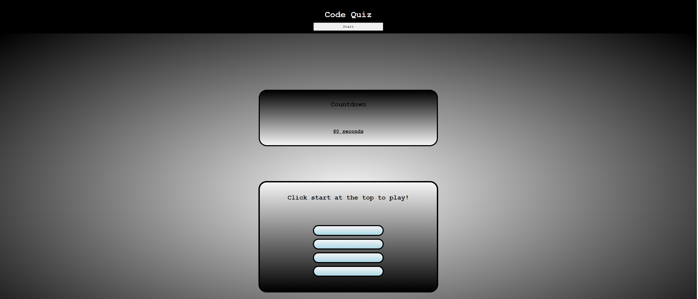

# Coding Quiz

## Description

this application is a simple interactive quiz with 4 questions. correct answers generate points and the user is able to save their highscore and initials at the end of the game.

## Usage

user iterates through 4 questions by choosing an anser in multiple choice style. the user is able to view their score, number of correct answers, and the previous highscore at the end of the game. the user can than choose to either reset the game or save their initials and highscore.

## Code Source

all code was written by Timothy Lee alone. No outside code was utilized, and no other person collaborated on this project.

## Screen Shot

## Link to deployed application

https://timl94.github.io/Coding-Quiz/